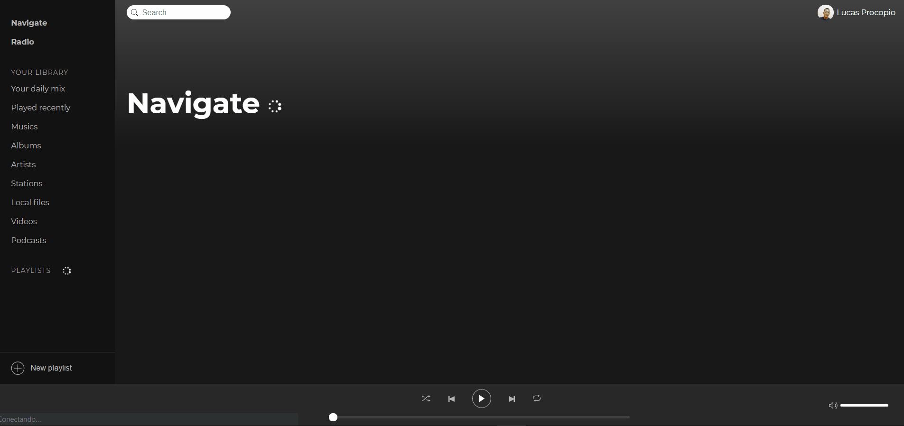

## Lutify

* This app is a study pourpose app which is a [Spotify](https://www.spotify.com/br/) clone
* This app was built using React, Redux, Redux Saga, Json server feel free to check the source code :) and contribute

---

---

## Installation

#### Here is a brief description to install the app in your machine

* 1 - Download or clone this repository
* 2 - On the root folder of this repository run `npm install` or `yarn` to install all dependencies
* 3 - Make sure you have [json server](https://github.com/typicode/json-server) installed
* 4 - run `json-server server.json -w -d 500 -p 3001` to start the json server
* 5 - run `npm start` or `yarn start` to start the application.
* 6- happy coding :)